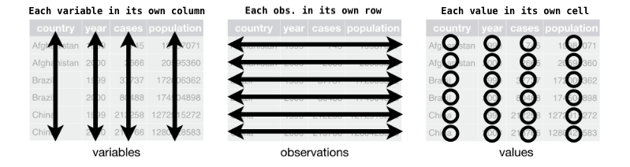

**LEARNING OBJECTIVE** Solidify tidyr

**TOPICS**

1. Recap tidyr
2. Clean the who data (https://www.who.int/tb/country/data/download/en/)


##Revise tidyr syntax

What does gather function do? Gather function gathers up columns into key value pairs.
```{r}
library(tidyverse)

table1
```

```{r}
gather(table1, key = "case_pop", value = "val", cases, population)
```

Another way to do the same thing is.
```{r}
gather(table1, key = "case_pop", value = "val", -country, -year)
```

Yet another way to do this.
```{r}
gather(table1, key = "case_pop", value = "val", 3:4)
```

##What is tidy data
```{r}

```


##Spread
```{r}
table2
```

Spread functions spreads a key value pair into multiple columns.
```{r}
spread(table2, key = type, value = count)
```

##Separate
```{r}
table3
```

```{r}
separate(table3, col = rate, into = c("cases", "population"), sep = "/")
```

##unite

```{r}
table5
```

Unite mirrors separate. It combines specified columns into a new column.
```{r}
unite(table5, col = "yearNew", century, year, sep = "Yo")
```

While it is rarely used, it is handy when doing things like combining entire rows of a tibble into a single value. See below.
```{r}
unite(table5, col = "everything", 1:ncol(table5), sep = ", ")
```

##Issues with gapminder_wide


```{r}
gapminderUntidy <- read_csv("assets/gapminder_wide.csv")

gapminderUntidy
```

What should be the level of observation for this data?
Every year, country is an observation

Data issues

1. There are multiple variables in a single column


##Lets clean a messy dataset

```{r}
who
```

Lets look at the names of the variables
```{r}
names(who)
```

```{r}
who
```
The column names in this data seems to encode multiple variables. So lets gather all those into a single column

```{r}
whoClean <- who %>% 
    select(-iso2, -iso3) %>% 
    gather(key = "combo", value = "value", -country, -year)

whoClean
```
There seem to be a lot of missing data. Lets remove those.
```{r}
whoClean <- whoClean %>% 
    filter(!is.na(value))

whoClean
```

Lets look at the unique values of combo
```{r}
unique(whoClean$combo)
```

Every unique combo seems to have two underscores other than newrel. So splitting this by using a "_" would yield inconsistent results. So lets add an additional "_"

```{r}
whoClean <- whoClean %>% 
    mutate(combo = str_replace(combo, "newrel", "newrel_")) 

whoClean
```

Lets again check to make sure things look good to proceed
```{r}
unique(whoClean$combo)
```

Now the combo column is ready to be separated.
```{r}
whoClean <- whoClean %>% 
    separate(col = combo, into = c("caseType", "ailment", "genderAge"), sep = "_")

whoClean
```

The last step is to separate the genderAge column
```{r}
whoClean <- whoClean %>% 
    separate(col = genderAge, into = c("gender", "ageCat"), sep = 1)

whoClean
```

```{r}
skimr::skim(whoClean)
```


```{r}
unique(whoClean$caseType)
```

```{r}
unique(whoClean$ailment)
```


