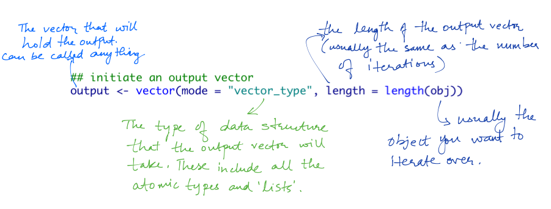
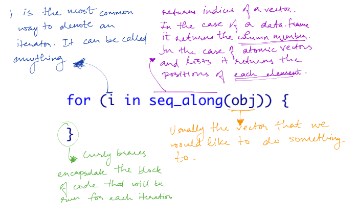
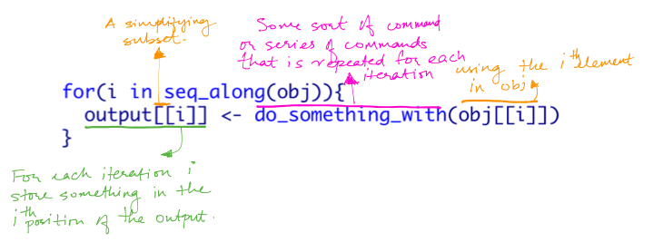

### **Learning objectives**
1. Write a for loop
2. Learn when to use a for loop and when to vectorize
3. Write our first function
4. Map that function to elements of a vector

### **Topics**
1. For loops
2. First function
3. Map

### **WHY?**
Repetitive tasks are very common in programming. 


### **Basic rules**

- *DO NOT REPEAT YOURSELF (D.R.Y)* - If you find yourself copying and pasting code to repeat similar tasks, **stop!**
- It is time to program that pancake flipper. Write a function (which we will learn later), a loop, or even better both.

## 👇👇👇 For loop 👇👇👇

### **A common recipe**
The code below shows a commonly used pattern for a for loop
```{r, eval=FALSE}
## Part 1: initiate an output vector
output <- vector(mode = "vector_type", length = length(obj))

## Part two: Setup the iteration
for (i in seq_along(obj)) {
    
    ##Part 3: do something and store the results
    ##(This could be a much longer piece of code)
    output[[i]] <- do_something_with(obj[[i]])
    
}
```


### The pieces: Output
```{r, echo=FALSE, out.width=700}

```
```{r}
##some object that I would like to iterate over
vec_iterate <- 1:10

##create the output vector
name_output <- vector(mode = "character", length = length(vec_iterate))

name_output
```

### Questions
- When should we use a list to store the output?
- When should we consider not creating a fixed length output vector? How do you store the output then?

### The pieces: The iterator

```{r, out.width=700}

```

### The pieces: Code block
```{r, out.width=700}

```

### Practice time 

👉👉[Task Set 1](https://puzhu.github.io/R4D/Classes/Class%2017/class17_exercises.nb.html)👈👈


## 👇👇👇 In class task 👇👇👇

###

```{r}
library(gapminder)
head(gapminder)
```

I would like to take gapminder data set and create a histogram if it is a continous variable and bar chart for `continent` and do nothing for `country`. 


