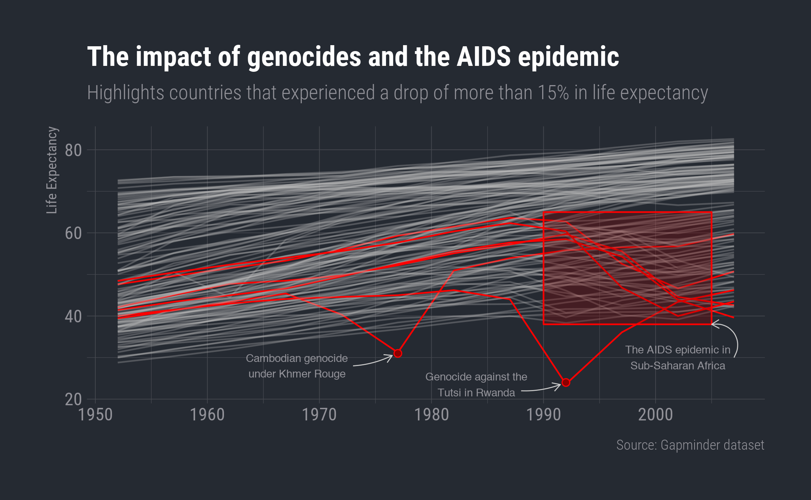

**Class Goal** : Replicate the chart below

The chart below uses a combination of selective highlighting of certain lines along with annotations to show the impact of genocides on life expectancy (since 1950). Our aim is to retrace the steps I took to create this chart and recreate it.

```{r, echo=FALSE}

```


## Get the data ready

Before we start, here is the list of packages we will be using

1. tidyverse (ggplot + dplyr)
2. gapminder
3. hrbrthemes

You probable do not have hrbrthemes installed on your system. If you do not, then go ahead and install it.

**Step 1**: Load the three packages using `library()`

```{r}
library(tidyverse); library(gapminder); library(hrbrthemes)
```


**Step 2**: Identify the rate of change for life expectancy. 

The chart identifies countries that experienced a drop in life expectancy that is greater than 15% at any point during the entire set of years for a particular country. This means that we have to calculate the rate of change for life expectancy. This can be calculated as the difference between the life expectancy in a current year from the previous observation in the data divided by the previous observation. In other words if the life expectancy in a country was 100 last observation and 95 this year. Then the rate of change would be (95 - 100)/100 = -5 % i.e. a drop of 5%.

We can identify the previous years life expectancy using `lag()`. I am going to illustrate this using data for the country of Afghanistan. I also keep only those columns that I am interested in for this analysis.
```{r}
## show the lagged value for just Afghanistan
gapminder %>% 
  filter(country == "Afghanistan") %>% 
  select(country, year, lifeExp) %>% 
  mutate(lag_lifeExp = lag(lifeExp))

```

the order matters
```{r}
gapminder %>% 
  filter(country == "Afghanistan") %>% 
  select(country, year, lifeExp) %>% 
  arrange(desc(year)) %>% 
  mutate(lag_lifeExp = lag(lifeExp))
```

Our next task is to calculate the rate of change in life expectancy using the formula we discussed earlier.
```{r}
## calculate the rate of change
gapminder %>% 
  filter(country == "Afghanistan") %>% 
  select(country, year, lifeExp) %>% 
  mutate(lag_lifeExp = lag(lifeExp),
         change_lifeExp = (lifeExp - lag_lifeExp) / lag_lifeExp * 100)
```

Now your task is to recreate this calculation for the *entire* gapminder dataset. Save your output in a variable called `plot_data`. 

A few things to consider before you start. The code above is specific to a single country. How would you make sure the same calculation is replicated for each country in the data? Or rather think about how to group this data. Visually confirm that they lagged values are being calculated correctly.


```{r}
plot_data <- gapminder %>% 
  select(country, year, lifeExp) %>% 
  group_by(country) %>% 
  mutate(change_lifeExp = (lifeExp - lag(lifeExp)) / lag(lifeExp) * 100)

plot_data
```


**Step 3**: Identify the countries that experience drops in life expectancy that is greater than 15%.

The best way to calculate this is to first find the minimum rate of change for life expectancy for the entire set of years for a country and compare it with 15%. In the case of the Afghanistan data here is how this calculation looks. The important thing to note here is that if even a single value in the country's panel of data is below the threshold then we want to make the *entire* country as "Sharp Decline".

```{r}
## show this calculation for Afghanistan
gapminder %>% 
  filter(country == "Afghanistan") %>% 
  select(country, year, lifeExp) %>% 
  mutate(lag_lifeExp = lag(lifeExp),
         change_lifeExp = (lifeExp - lag_lifeExp) / lag_lifeExp * 100,
         change_type = if_else(min(change_lifeExp, na.rm = T) < -15, "Sharp Decline", "Stable"))
```

You can also use `any()` to do this h/t Zeenat.
```{r}
gapminder %>% 
  filter(country == "Afghanistan") %>% 
  select(country, year, lifeExp) %>% 
  mutate(lag_lifeExp = lag(lifeExp),
         change_lifeExp = (lifeExp - lag_lifeExp) / lag_lifeExp * 100,
         change_type = if_else(any(change_lifeExp < 1, na.rm = T), "Sharp Decline", "Stable"))
```

Try and replicate this for `plot_data` you saved earlier. Before you start, consider how to group the data so that you can find the minimum rate of change in life expectancy for each country so that it can compared with -15. If there is a single value that is less than -15% for a country then the entire country should be marked as "Sharp Decline".

```{r}
plot_data <- gapminder %>% 
  select(country, year, lifeExp) %>% 
  group_by(country) %>% 
  mutate(change_lifeExp = (lifeExp - lag(lifeExp)) / lag(lifeExp) * 100,
         change_type = if_else(any(change_lifeExp < -15, na.rm = T), "Sharp Decline", "Stable"))

plot_data %>% 
  filter(change_type == "Sharp Decline") %>% 
  distinct(country)
```


**Step 4**: Confirm that you did this correctly.

Identify the `distinct()` or `unique()` countries that experienced "Sharp Declines" (drop of more than 15% in life expectancy). This should yield the following list of countries - Botswana, Cambodia, Lesotho, Rwands, Swaziland and Zimbabwe.

```{r}
plot_data
```


## Make the plot
Now lets create the plot. Our first task is to create the base line plot which has one line for each country. Below is my first attempt.
```{r without grouping}
## basic chart without grouping
ggplot(data = plot_data, mapping = aes(x = year, y = lifeExp)) +
  geom_line()
```

This looks weird. Right now the line geom is drawing a line for each combination of year and lifeExp without grouping it by countries. Correct, the plot above by mapping the `group` aesthetic to the country variable. You will need to apply this on the data you created previously since you don't have access to my data.
```{r}
plot_data %>% 
  filter(country %in% c('Afghanistan', "Albania", "Canada"))
```

```{r}
plot_data %>% 
  filter(country %in% c('Afghanistan', "Albania", "Canada")) %>% 
  ggplot(mapping = aes(x = year, y = lifeExp)) +
  geom_line() +
  geom_point(mapping = aes(colour = country))
```


```{r}
ggplot(data = plot_data, mapping = aes(x = year, y = lifeExp, group = country)) +
  geom_line()
```


The next task is to assign the variable that marks wether there was a sharp decline in life expectancy as the color of each line.

```{r}
ggplot(data = plot_data, mapping = aes(x = year, y = lifeExp, group = country, colour = change_type)) +
  geom_line()
```

```{r}
ggplot(data = plot_data, mapping = aes(x = year, y = lifeExp, group = country, colour = change_type)) +
  geom_line() +
  scale_color_manual(values = c("Sharp Decline" = "red", "Stable" = "grey"))
```


Looking good....However the colors of the lines don't match those in the chart that we are trying to copy. We can fix that by manually mapping the values to colors using `scale_color_manual()`. This function simply asks ggplot to ignore the default mapping of colors and instead use that specified within `scale_color_manual()`.

```{r}
## use the scale_color_manual to manually map colors to values

```

This is looking better. However, the grey lines are too strong and hiding the red ones. Lets try to map the alpha aesthetic to the change_type variable as well to fix this.

```{r}
## map the change_type to alpha aesthetic
ggplot(data = plot_data, mapping = aes(x = year, y = lifeExp, group = country, colour = change_type, alpha = change_type)) +
  geom_line() +
  scale_color_manual(values = c("Sharp Decline" = "red", "Stable" = "grey"))
```

Hmmm... that did not work well. This is because ggplot is automatically assigning alpha values (one for "Sharp Decline" and another for "Stable). Use the same pattern as above but use `scale_alpha_manual()` instead to set the alpha aesthetic to 1 if "Sharp Decline" and 0.3 if "Stable".


```{r}
ggplot(data = plot_data, mapping = aes(x = year, y = lifeExp, group = country, colour = change_type, alpha = change_type)) +
  geom_line() +
  scale_color_manual(values = c("Sharp Decline" = "red", "Stable" = "grey")) +
  scale_alpha_manual(values = c("Sharp Decline" = 1, "Stable" = 0.3))
```


Now the basic chart is ready. Lets now start working on making this look good. First I add the `theme_ft_rc()` from hrbrthemes. Like ggthemes that you have used before hrbrthemes is just another extension of ggplot that gives some additional themes and a few helper functions. Visit this [github repo](https://github.com/hrbrmstr/hrbrthemes) for more information on it. theme

```{r}
## apply theme_ft_rc()

ggplot(data = plot_data, mapping = aes(x = year, y = lifeExp, group = country, colour = change_type, alpha = change_type)) +
  geom_line() +
  scale_color_manual(values = c("Sharp Decline" = "red", "Stable" = "grey")) +
  scale_alpha_manual(values = c("Sharp Decline" = 1, "Stable" = 0.3)) +
  theme_ft_rc()

```

Nice! Now lets use the theme function to do some more changes to this plot. First lets set the x axis title to blank.

```{r}
## set the axis title to blank
ggplot(data = plot_data, mapping = aes(x = year, y = lifeExp, group = country, colour = change_type, alpha = change_type)) +
  geom_line() +
  scale_color_manual(values = c("Sharp Decline" = "red", "Stable" = "grey")) +
  scale_alpha_manual(values = c("Sharp Decline" = 1, "Stable" = 0.3)) +
  theme_ft_rc() +
  theme(
    axis.title.x = element_blank()
  )
```

Your turn... Remove the legend by setting legend.position = "none" within the `theme()` function.


```{r}
## set the axis title to blank
ggplot(data = plot_data, mapping = aes(x = year, y = lifeExp, group = country, colour = change_type, alpha = change_type)) +
  geom_line() +
  scale_color_manual(values = c("Sharp Decline" = "red", "Stable" = "grey")) +
  scale_alpha_manual(values = c("Sharp Decline" = 1, "Stable" = 0.3)) +
  theme_ft_rc() +
  labs(y = "Life Expectancy",
       title = "The impact of genocides and the AIDS epidemic",
       caption = "Source: gapminder") +
  theme(
    axis.title.x = element_blank(),
    legend.position = "none"
  )
```


This chart is now ready for some annotations.


## Annotate the chart
While it is possible to annotate your charts programatically it is often difficult to exert fine control on placement of different elements just using code. So for this final stage I usually recommend manually specifying elements (rather than mapping them through data)
```{r}
## add the title, subtitle, y-axis labels and caption

```


Next let's add annotation to the plot indicating the first dip for Cambodia.

```{r}
## add a line segment with an arrow and text indicating the genocide in Cambodia
ggplot(data = plot_data, mapping = aes(x = year, y = lifeExp, group = country, colour = change_type, alpha = change_type)) +
  geom_line() +
  annotate(geom = "point", x = 1977, y = 31, shape = 21, colour = "red", fill = "firebrick") +
  annotate(geom = "curve", x = 1972, xend = 1976.5, y = 28, yend = 30, colour = "grey90", curvature = 0.3, arrow = arrow(length = unit(0.20,"cm")), size = 0.4) +
  annotate(geom = "text", x = 1967,  y = 28, colour = "grey90", label = str_wrap("Cambodian genocide under Khmer Rouge", width = 18), size = 2.5) +
  annotate(geom = "point", x = 1992, y = 23.5, shape = 21, colour = "red", fill = "firebrick") +
  annotate(geom = "curve", x = 1988, xend = 1991.5, y = 20, yend = 23, colour = "grey90", curvature = 0.3, arrow = arrow(length = unit(0.20,"cm")), size = 0.4) +
  annotate(geom = "text", x = 1984,  y = 22, colour = "grey90", label = str_wrap("Genocide against the Tutsi in Rwanda", width = 20), size = 2.5) +
  annotate(geom = "rect", xmin = 1990, xmax = 2005, ymin = 40, ymax = 62, colour = "red", fill = "red", alpha = 0.3) +
  annotate(geom = "text", x = 2002,  y = 30, colour = "grey90", label = str_wrap("The AIDS epidemic in sub-saharan Africa", width = 20), size = 2.5) +
  annotate(geom = "curve", x = 2007, xend = 2005, y = 30, yend = 40, colour = "grey90", curvature = 0.8, arrow = arrow(length = unit(0.20,"cm")), size = 0.4) +
  scale_color_manual(values = c("Sharp Decline" = "red", "Stable" = "grey")) +
  scale_alpha_manual(values = c("Sharp Decline" = 1, "Stable" = 0.3)) +
  theme_ft_rc() +
  labs(y = "Life Expectancy",
       title = "The impact of genocides and the AIDS epidemic",
       subtitle = "Countries that experienced a drop of more than 15% in life expectancy are highlighted",
       caption = "Source: gapminder") +
  theme(
    axis.title.x = element_blank(),
    legend.position = "none"
  )


```


Now repeat this for Rwanda as well.


YOUR CODE HERE.


The next step is to add a point to indicate the lowest value. Lets first try it for Cambodia.

```{r}

## add a point indicating the position of the min value for Cambodia

```


Now do the same for Rwanda.

YOUR CODE HERE.


Now the final stage is to add the annotation for the sub saharan countries that went through the AIDS epidemic.

```{r}

```

Adjust the position and shape of the rectangle so that it looks similar to the final plot and add arrows and text labels to complete this plot!

YOUR CODE HERE


