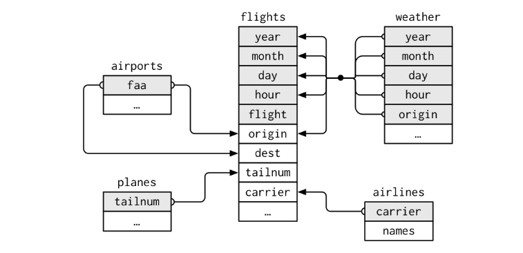
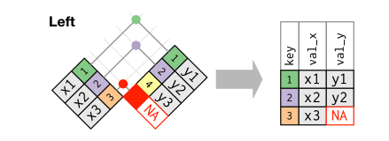

##Description
This class prep notebook will introduce the concept of data joins in R (using dplyr).

##A closer look at nycflights13
Data joins are fundamental to data analysis and are used to bring different tables together using common ***"keys"***. I will use the `nycflights13` package along with the `tidyverse` to illustrate joins. Lets load these packages first. 
```{r, message=FALSE}
library(tidyverse); library(nycflights13)
```
So far we have used a single dataset from the `nycflights13` package - `flights` - to do all our work. There are several other datasets that come with the `nycflights13` package that we haven't seen yet. Lets take a look at a sample of 5 rows from each of these.

`planes` is a dataset that gives the characteristics of the different plane types (not flights) that took off from NYC. Each plane is identified by its `tailnum`.
```{r}
sample_n(planes, size = 5)
```

`weather` gives information about the weather at each origin airport every hour.
```{r}
sample_n(weather, size = 5)
```
`airports` gives information about all the airports in the flights dataset i.e. these are three origin airports and the destinations (encoded as `dest` column in `flights`). Each airport is identified by its `faa` code.^[The first column is not printing correctly for some reason.]
```{r}
sample_n(airports, size = 5)
```

`airlines` is a simple two column dataset with the names of the airline carriers. Each row can be uniquely identified by the `carrier` code.
```{r}
sample_n(airlines, size = 5)
```

You might have already noticed that some of the variables in these datasets are present in the `flights` tibble. I have selected only these variables from the flights data below. Lets take a look at these in the flights data.^[Note that the `airports` tibble contains information on both the `origin` column (i.e. the NYC airports) and the `dest` column from the `flights` data.]

```{r}
flights %>% 
    select(origin, year, month, day, hour, tailnum, dest, carrier) %>% 
    sample_n(size = 5)
```
The graphic below is a visual representation of these links. Note that the different components could also relate to one another.^[For instance, can you identify the relationship between `airports` and `weather` tibbles?]
```{r}

```
<small>**Source**: [R for Data Science](https://r4ds.had.co.nz/relational-data.html#nycflights13-relational) - Hadley Wickham</small>
 
**Question**: Before we take this further, can you identify a few reasons for maintaining this information in separate tibble i.e. why not have a single large table that contains everything?

##Keys are key
Keys can be of two types.^[Adapted from [R for Data Science](https://r4ds.had.co.nz/relational-data.html#keys) - Hadley Wickham]

1. A **primary** key uniquely identifies an observation in its **own table**. For example, `tailnum` in `planes` is a primary key because it uniquely identifies each plane in the planes table.
2. A **foreign** key uniquely identifies an observation in **another table**. For example, the `tailnum` is a foreign key in `flights` because it it matches each flight to a unique plane in the `planes`.

As noted earlier, the different tibbles in the `nycflights13` package are linked to each other through a few common variables. These are primary and foreign keys that we can use to combine or in other words join these tables together. But before we get into that lets delve into what makes a key.

In the simplest cases, keys can be formed using a single column For instance, in the case of `planes` each row/observation in that tibble can be uniquely identified using `tailnum`. We can tell this by grouping the data by the primary key to see whether there are groups that have more than one value.
```{r}
planes %>% 
    group_by(tailnum) %>% 
    filter(n() > 1)
```
Nice. Our guess was correct and each observation in planes can be uniquely identified using the primary key `tailnum`. Note that the `tailnum` is a foreign key in the flights data.

However, a key could also be a combination of columns in a dataset. Lets try and find the keys for the `weather` dataset.
```{r}
head(weather)
```
A primary key must uniquely identify every observation in that tibble. This means that if I group by that primary key (which could be a combination of columns) the number of observations in each group should be exactly one i.e. each row is uniquely identified. Lets try grouping the `weather` data by month and day to see if that works.

```{r}
weather %>% 
    group_by(month, day) %>% 
    summarise(nObs = n())
```

Hmmm.. That did not work. Every combination of month and day seems to have 72 observations (except for the first day). Lets add hour into the mix to see if that helps.

```{r}
weather %>% 
    group_by(month, day, hour) %>% 
    summarise(nObs = n())
```
Better. Now we seem to have exactly 3 observations for every single combination of `month`, `day` and `hour`. Lets add, `origin` to the mix.

```{r}
weather %>% 
    group_by(month, day, hour, origin) %>% 
    summarise(nObs = n())
```

Nice! This seems to have worked. Lets however, be certain and use `filter()` to see if there are no combinations of these columns that have more than one observation.

```{r}
weather %>% 
    group_by(month, day, hour, origin) %>% 
    filter(n() > 1)
```

DAMN! There seem to be two different weather observations for November 3rd, 1 AM at all three `origin` airports. So our primary key combo does not uniquely identify every single observation in the data i.e. it is not a primary key yet.

This is unforntunately a common problem when dealing with data. In our case here, out of the 26115 rows of data in the `weather` there are 6 that cannot be uniquely identified. We have two courses of action. One would be to `summarise()` the repeating values - i.e for rows that repeat themselves, use the `mean()` of the two observations to collapse the two rows for each combo into one. Another course of action would be to arbitarily filter out one of the two rows. Either of these would yield a final dataset that is removes the repeating values. 

It is not necessary that a dataset should have a primary key. For instance, the `flights` data does not have a primary key. 

**Question**: Play around with the `flight`s data to see if you can test my claim above i.e. that it does not have a primary key.

##A simple left join
Now that we have a sense for primary and foreign keys, let's try out a simple data join. Say I want to study the relationship between departure delay and the manufacturer of an airplane. The departure delay is contained in the `dep_delay` variable in `flights` while the `manufacturer` is recorded in the `planes` dataset. We can bring these together using a `left_join()`. From the help files I get the following definition (slightly modified):

> A left_join(x, y, by = "key") returns all rows from x, and all columns from x and y. Rows in x with no matching key in y will have NA values in the new columns. If there are multiple matches between x and y, all combinations of the matches are returned.

Graphically this can be illustrated as follows:
```{r, class.source="text-centre"}

```

Lets apply the definition from the help file to explain this graphic. There are two tables - x and y. The keys are represented as numbers, while the variables that we want in our combined table are val_x from x and val_y from y. The table x has three values for its primary key - 1, 2 and 3. Out of these 1 and 2 are present in table y while 3 is not. Table y also has an additional key value 4 that is not present in table x.

Based on the definition of `left_join()` the output should have all the rows from x and all columns from x and y. So the output above has the three rows from x with an additional column from y with the missing value for key = 3 represented by NA.

Now lets use this to join `manufacturer` information to `flights`. Notice how I have used `select()` to only select the columns I am interested in for this analysis.
```{r}
left_join(flights %>% 
              select(1:3, tailnum, dep_delay), 
          planes %>%
              select(tailnum, manufacturer), 
          by = "tailnum")
```

Now lets explore to see if there is any relationship between departure delays and manufacturer.
```{r}
left_join(flights %>% 
              select(1:3, tailnum, dep_delay), 
          planes %>%
              select(tailnum, manufacturer), 
          by = "tailnum") %>% 
    group_by(manufacturer) %>% 
    summarise(meanDelay = mean(dep_delay, na.rm = T),
              nObs = n()) %>% 
    arrange(desc(meanDelay))
```

This is a simple illustration of `left_join()` we will explore more complicated forms of the same data join and several other types of joins during the class.